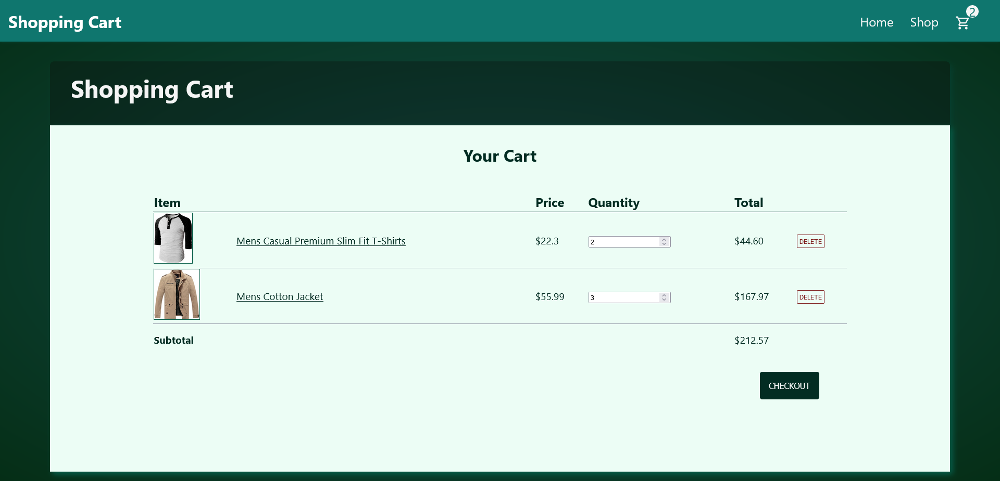

# Shopping Cart

This is yet another React-based project that simulates an online shop. It is composed of a home page, a shop page that renders a list of products from the [FakeStore API](https://fakestoreapi.com/), a product page for when the user clicks at a product, and a shopping cart page, that dynamically changes as the user adds and removes products from their cart. This project makes heavy use of the React Router package, and really challenged my React capabilities overall.

To begin this project, I, as usual, started with the basic CSS at the Home page, which I think turned out pretty nicely. I then moved on to the shop page, and then to the shopping cart. The shopping cart was the most challenging page to style, as I had never worked with HTML tables beforehand, so it was an interesting experience. While styling the website, I took care to make it as responsive as I could, but the shopping cart page only really works with cellphones if they are on landscape mode. Otherwise, it should work on all other screensizes.

After finishing the CSS, I moved on to the actual site functionalities, starting with the product pages. The product pages weren't too challenging, but it still required some effort to figure out some of the things that it needed to be able to work properly. At last, I programmed the shopping cart functionalities, which was by far the most challenging part of the project. In the end, it was very satisfying to finish it and see it all properly.

I also tried to use the React Testing library at the end, but I was very tired of working on this project by that point, so I pretty much gave up after a frustating start. Might revisit it later, be it on this project or on a future one, but for now I am ready to move on.

Image used on homepage: https://www.pexels.com/pt-br/foto/fotografia-com-foco-seletivo-de-mulher-sentada-em-um-banco-de-madeira-marrom-1959855/